# Sales in USD, iOS app


[](https://github.com/anthony1810/sales-ios/actions/workflows/app.yml)
[](https://github.com/anthony1810/sales-ios/actions/workflows/modules.yml)

A SwiftUI app that signs you in, lists every product with how many times it sold, and opens one to
read its sales newest first with each amount converted to US dollars. Three screens: Login, Product
list and Product detail. iOS 17.0, Xcode 26, Swift 6 with complete strict concurrency.

The app never converts a currency itself. It asks a companion service, `sales-middleware`, for one
direct-to-USD rate per currency. That repository has its own README.

## Architecture

Horizontal layers inside vertical feature slices. Each screen is one Swift package with UI,
Presentation, Feature and API targets. Shared modules carry technical concerns only. The app target
is the composition root, the only place concrete types meet.

```
App/
  Composition/          the only place concrete types meet
  Composition/Debug/    launch arguments, DEBUG only
Modules/Login/          LoginFeature, LoginAPI, LoginPresentation, LoginUI
Modules/ProductList/    the same four, plus ProductListTestSupport
Modules/ProductDetail/  the same four, plus ProductDetailTestSupport
Modules/Shared/         Auth, HTTPClient, SharedPresentation, TestSupport
```

Inside a vertical the arrows point one way. UI depends on Presentation, Presentation on Feature, and
the API target implements the seam the Feature declares. `LoginUI` cannot build a `Credentials` and
`LoginPresentation` cannot read an HTTP status code, because neither type is in scope.

The architecture is enforced, not documented.
[`Scripts/architecture-guard.sh`](Scripts/architecture-guard.sh) runs as the first step of CI and
fails the build on any import that crosses a boundary.

| # | Rule | Why |
|---|---|---|
| 1 | SwiftUI and UIKit may only be imported by the UI targets and the app. | UI is the only layer that depends on Apple's frameworks. Everything else could back a Mac app or a command line tool unchanged. |
| 2 | Login, ProductList and ProductDetail never import each other. | Each screen knows nothing about the others. The composition root translates between them. |
| 3 | `HTTPClient` may only be imported by the composition root and `Auth`, never by a vertical. | A feature's API layer stays ignorant of how the request is made, URLSession or anything else. |
| 4 | The backend host is named in one file, `ServiceURLs`. | One file to change when the environment changes. |
| 5 | A TestSupport module may only be linked by a test bundle. | Test doubles never ship. |
| 6 | `Auth` may not be imported by a product vertical. | The product screens depend on the token's behaviour but never name it. They receive an already signed client. |

**Each vertical owns its own domain. There is no shared model package.** In the list a `Sale` is one
field, a product id, because the list counts sales. In the detail a `Sale` carries `Money` and a
`Date`, because the detail shows them. `App/Composition/Product+ProductDetail.swift` translates one
vertical's `Product` into the other's, and it is the only file that imports both.

**Business rules live in policy types, never on the models.** `ProductSummaryPolicy` counts sales per
product and sorts by name. `ProductDetailPolicy` filters, orders newest first, converts and totals.
Both are pure functions, so their tests need no network, no clock and no test doubles.

**Coordination lives in the composition layer.** `ProductListService` and `ProductDetailService` fetch
from two sources at once and hand the results to a policy. They hold no business rule. Delete either
and nothing about the business is lost.

## Module map

| Package | Targets | Tests |
|---|---|---|
| [Login](Modules/Login) | LoginFeature, LoginAPI, LoginPresentation, LoginUI | 26 |
| [ProductList](Modules/ProductList) | ProductListFeature, ProductListAPI, ProductListPresentation, ProductListUI, ProductListTestSupport | 26 |
| [ProductDetail](Modules/ProductDetail) | ProductDetailFeature, ProductDetailAPI, ProductDetailPresentation, ProductDetailUI, ProductDetailTestSupport | 43 |
| [Auth](Modules/Shared/Auth) | Auth | 12 |
| [HTTPClient](Modules/Shared/HTTPClient) | HTTPClient, HTTPClientLive | 4 |
| [SharedPresentation](Modules/Shared/SharedPresentation) | SharedPresentation | 13 |
| [TestSupport](Modules/Shared/TestSupport) | TestSupport | 8 |
| App target | SalesInUSD, SalesInUSDTests, SalesInUSDUITests | 55 |

## Continuous integration

Two workflows run on every pull request to `main` and every push to `main`.

| Workflow | What it runs |
|---|---|
| `CI-App` | the architecture guard, then the `SalesInUSD` scheme with Thread Sanitizer enabled: unit, acceptance and UI tests |
| `CI-Modules` | `swift test` for every package that has a test target, discovered by a matrix job, with warnings treated as errors |

`CI-Modules` runs on the Mac, so the iOS snapshot tests compile out there. `CI-App` runs the
`SalesInUSD` scheme, whose test action holds only the app's own two bundles. Neither job runs the
snapshot tests today. See Known limits.

## Testing strategy

187 tests in five kinds, each aimed at one risk.

- **Unit tests**: 141, proving one type at a time. Every policy, mapper, endpoint, formatter and view model.
- **Snapshot tests**: 16 tests, 32 recorded references, proving every screen state renders as designed in light and dark.
- **Acceptance tests**: 21, driving the real composition root with a stubbed HTTP layer, written as user journeys.
- **UI automation tests**: 5, driving the shipped app on a simulator through named screens.
- **End to end tests**: 4, proving the live services still answer in the shape the mappers expect.

| Kind | Where | Runs by default |
|---|---|---|
| Unit | every `Modules/*/Tests` plus `AppTests/Composition` | yes |
| Snapshot | `Modules/*/Tests/*UITests/Views` | no, see Known limits |
| Acceptance | [AppTests/Acceptance](AppTests/Acceptance) | yes |
| UI automation | [AppUITests](AppUITests) | one of five; four need `END_TO_END=1` |
| End to end | [AppTests/EndToEnd](AppTests/EndToEnd) | no, needs `END_TO_END=1` |

### Acceptance tests

Each one builds the real `AppComposition` with an `HTTPClientStub` that answers per URL, then drives
it the way the app does and asserts what the customer ends up seeing.

| Suite | Journeys |
|---|---|
| [SignInAcceptanceTests](AppTests/Acceptance/SignInAcceptanceTests.swift) | 9: signing in, keeping the token, a rejected password, signing in offline, returning with and without a stored session, and the session expiring |
| [ProductListAcceptanceTests](AppTests/Acceptance/ProductListAcceptanceTests.swift) | 5: sales counts, human name order, a sale with no matching product, offline, and retrying after a failure |
| [ProductDetailAcceptanceTests](AppTests/Acceptance/ProductDetailAcceptanceTests.swift) | 7: newest first, conversion, the total, the middleware being down, an unquoted currency, and a failed load |

### UI automation tests

The app reads two launch arguments in DEBUG only, through
[`AppComposition.launch(arguments:)`](App/Composition/Debug/LaunchArguments.swift): `-reset` clears
the Keychain token so the app starts signed out, and `-connectivity offline` swaps in an HTTP client
that always fails. The tests drive named screens rather than first matches.

```swift
let app = XCUIApplication.launch(.offline, session: .signedOut)
app.loginScreen.signIn(as: .valid)
XCTAssertTrue(app.loginScreen.isShowingError)
```

That one needs no network. The other four sign in against the real backend and are skipped unless
`END_TO_END=1` is set.

## Login

Username, password, and a submit button that stays disabled until both fields have something in
them. Every state below is a recorded snapshot from `LoginSUViewSnapshotTests`.

<table>
  <tr>
    <th colspan="2">Empty</th>
    <th colspan="2">Filled</th>
    <th colspan="2">Loading</th>
    <th colspan="2">Error</th>
    <th colspan="2">Session expired</th>
  </tr>
  <tr>
    <td><a href="Modules/Login/Tests/LoginUITests/Views/__Snapshots__/LoginSUViewSnapshotTests/empty.light.png"></a></td>
    <td><a href="Modules/Login/Tests/LoginUITests/Views/__Snapshots__/LoginSUViewSnapshotTests/empty.dark.png"></a></td>
    <td><a href="Modules/Login/Tests/LoginUITests/Views/__Snapshots__/LoginSUViewSnapshotTests/filled.light.png">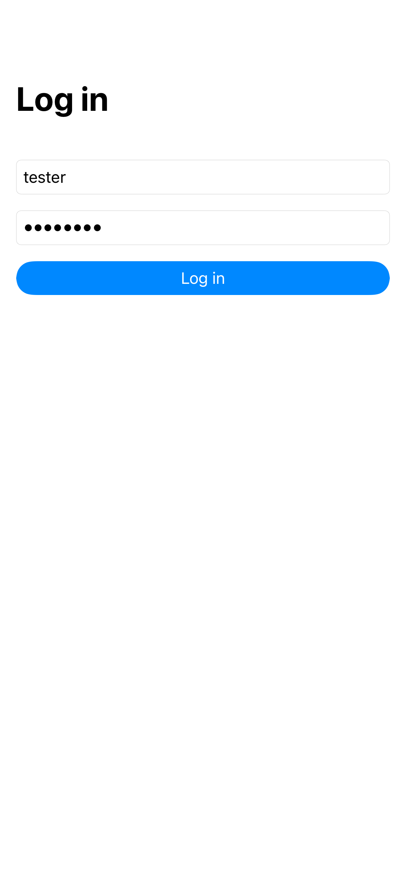</a></td>
    <td><a href="Modules/Login/Tests/LoginUITests/Views/__Snapshots__/LoginSUViewSnapshotTests/filled.dark.png">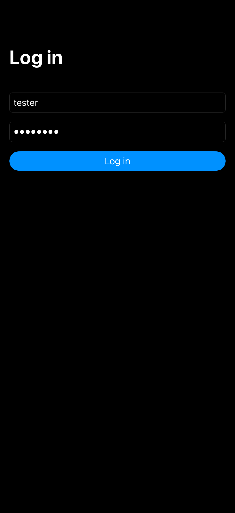</a></td>
    <td><a href="Modules/Login/Tests/LoginUITests/Views/__Snapshots__/LoginSUViewSnapshotTests/loading.light.png">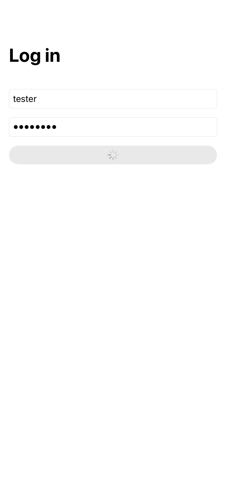</a></td>
    <td><a href="Modules/Login/Tests/LoginUITests/Views/__Snapshots__/LoginSUViewSnapshotTests/loading.dark.png">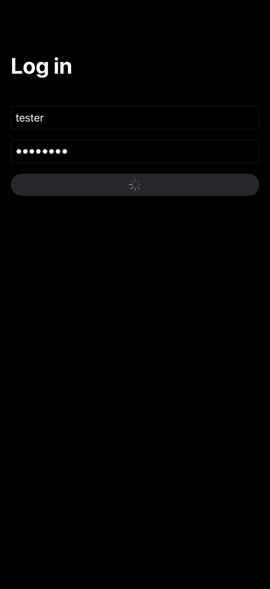</a></td>
    <td><a href="Modules/Login/Tests/LoginUITests/Views/__Snapshots__/LoginSUViewSnapshotTests/error.light.png">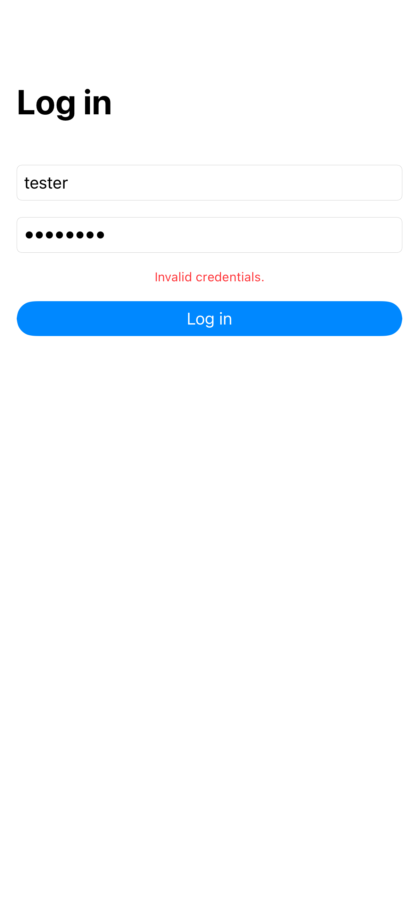</a></td>
    <td><a href="Modules/Login/Tests/LoginUITests/Views/__Snapshots__/LoginSUViewSnapshotTests/error.dark.png">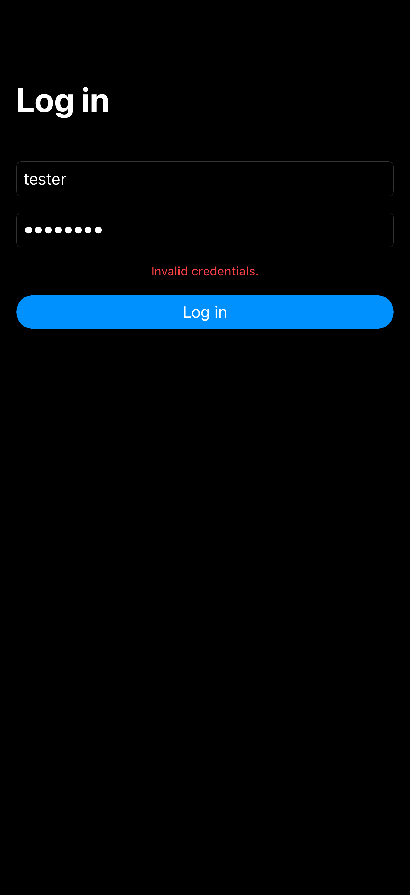</a></td>
    <td><a href="Modules/Login/Tests/LoginUITests/Views/__Snapshots__/LoginSUViewSnapshotTests/sessionExpired.light.png">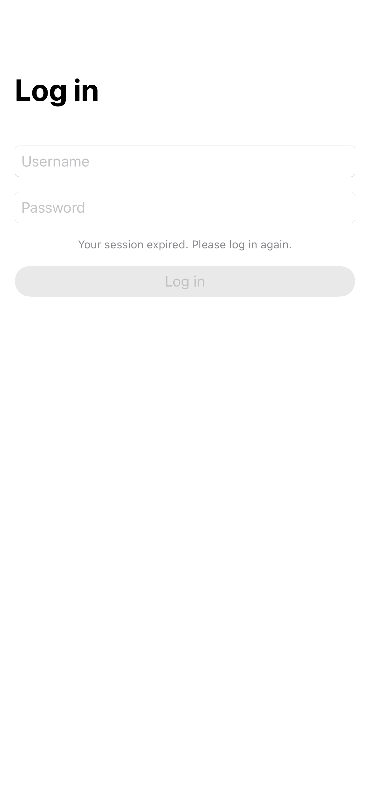</a></td>
    <td><a href="Modules/Login/Tests/LoginUITests/Views/__Snapshots__/LoginSUViewSnapshotTests/sessionExpired.dark.png"></a></td>
  </tr>
</table>

### Data flow

`LoginSUView` binds to `LoginViewModel`, which calls a plain function, not an object. The composition
root passes `useCase.login`, so the view model cannot reach anything else on the use case.

```
LoginSUView -> LoginViewModel -> LoginUseCase -> AuthAPI (seam)
                                              -> TokenStore (seam)
RemoteAuthAPI -> LoginEndpoint -> HTTPClient -> LoginResponseMapper -> Token
```

`LoginResponseMapper` is the only file that knows the server calls the field `access_token`. A 401
there throws a `LoginUseCase.Error.invalidCredentials`, carrying the server's own message, so the
text under the password field is the server's and no layer rewrites it.

## Product list

Every product with how many times it sold, sorted by name, tappable through to the detail.

<table>
  <tr>
    <th colspan="2">Content</th>
    <th colspan="2">Loading</th>
    <th colspan="2">Empty</th>
    <th colspan="2">Error</th>
    <th colspan="2">Refresh failure</th>
  </tr>
  <tr>
    <td><a href="Modules/ProductList/Tests/ProductListUITests/Views/__Snapshots__/ProductListSUViewSnapshotTests/content.light.png">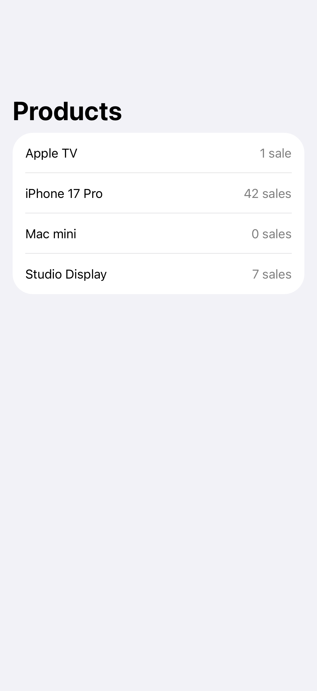</a></td>
    <td><a href="Modules/ProductList/Tests/ProductListUITests/Views/__Snapshots__/ProductListSUViewSnapshotTests/content.dark.png">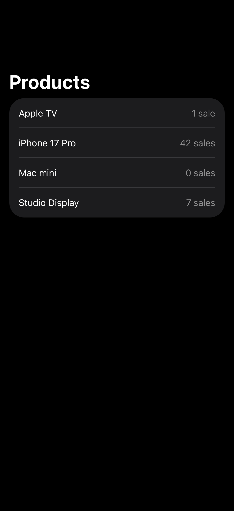</a></td>
    <td><a href="Modules/ProductList/Tests/ProductListUITests/Views/__Snapshots__/ProductListSUViewSnapshotTests/loading.light.png">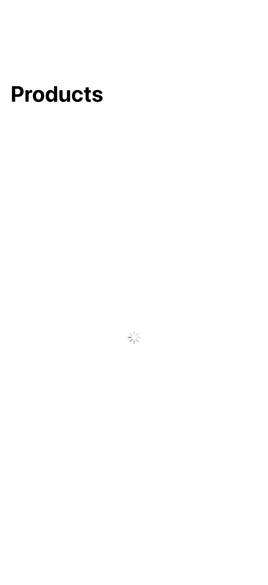</a></td>
    <td><a href="Modules/ProductList/Tests/ProductListUITests/Views/__Snapshots__/ProductListSUViewSnapshotTests/loading.dark.png"></a></td>
    <td><a href="Modules/ProductList/Tests/ProductListUITests/Views/__Snapshots__/ProductListSUViewSnapshotTests/empty.light.png">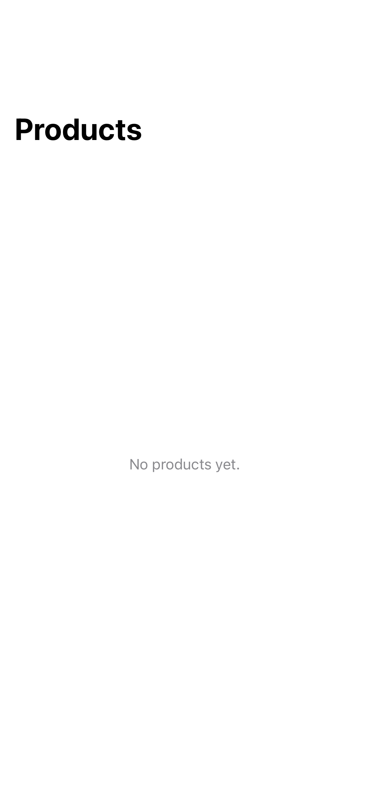</a></td>
    <td><a href="Modules/ProductList/Tests/ProductListUITests/Views/__Snapshots__/ProductListSUViewSnapshotTests/empty.dark.png">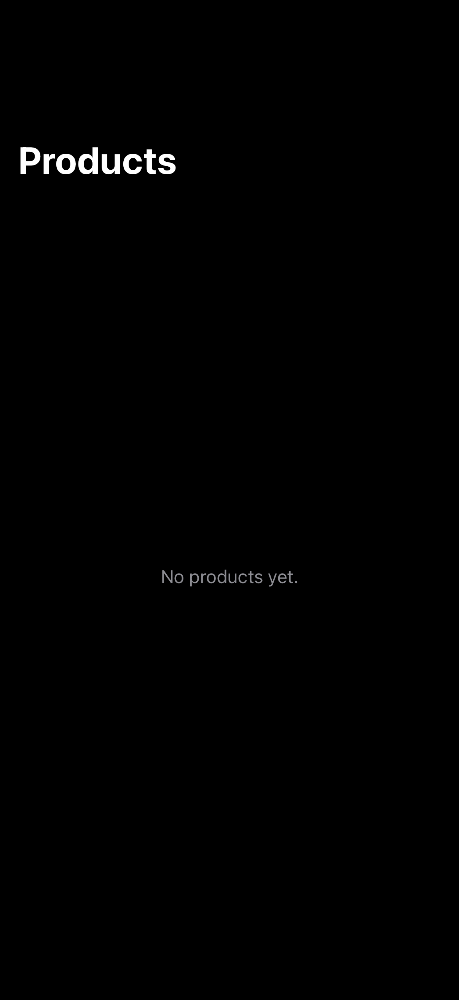</a></td>
    <td><a href="Modules/ProductList/Tests/ProductListUITests/Views/__Snapshots__/ProductListSUViewSnapshotTests/error.light.png">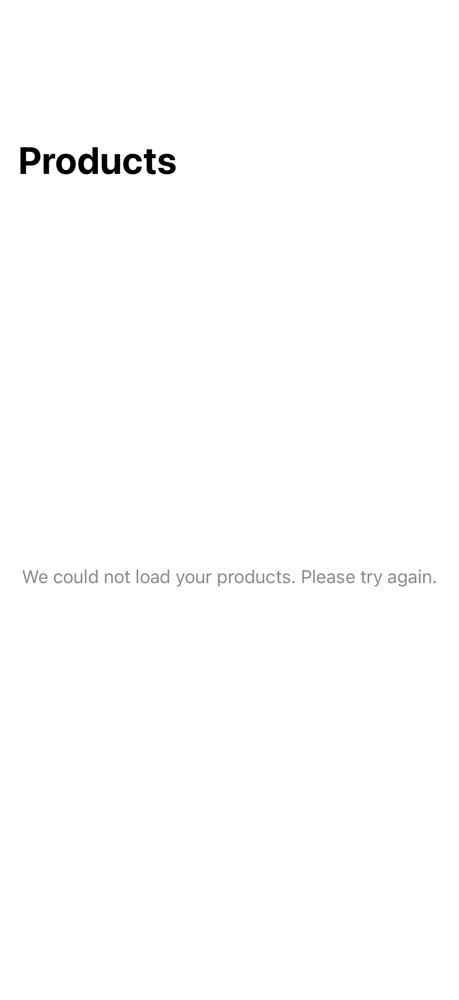</a></td>
    <td><a href="Modules/ProductList/Tests/ProductListUITests/Views/__Snapshots__/ProductListSUViewSnapshotTests/error.dark.png">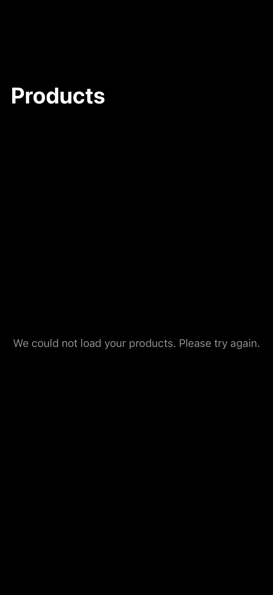</a></td>
    <td><a href="Modules/ProductList/Tests/ProductListUITests/Views/__Snapshots__/ProductListSUViewSnapshotTests/refreshFailure.light.png">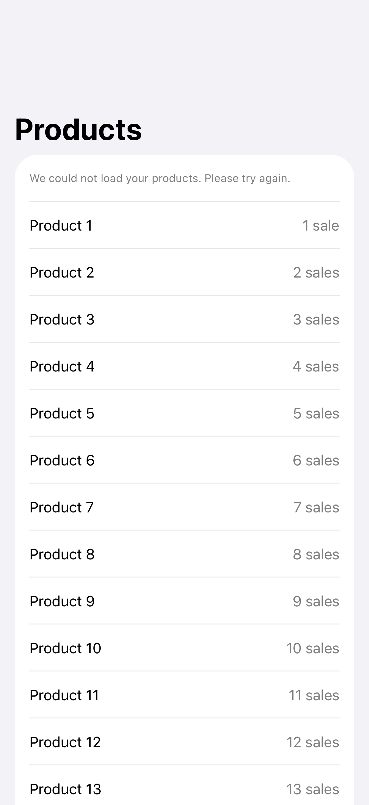</a></td>
    <td><a href="Modules/ProductList/Tests/ProductListUITests/Views/__Snapshots__/ProductListSUViewSnapshotTests/refreshFailure.dark.png">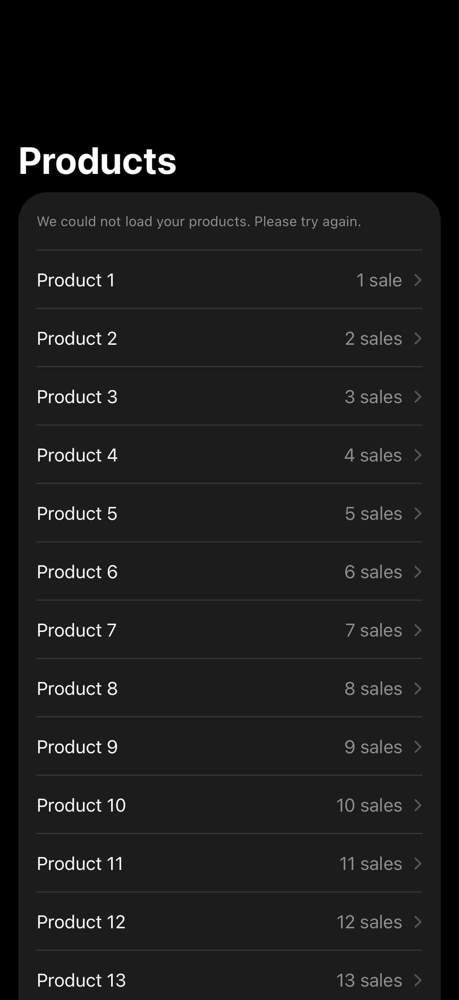</a></td>
  </tr>
</table>

### Data flow

```
ProductListSUView -> ProductListViewModel -> ProductListService -> /products
                                                                -> /sales
                                          -> ProductSummaryPolicy -> ProductRowMapper
```

`ProductListService` starts both requests with `async let` and waits for both, so the screen waits
once rather than twice. `ProductSummaryPolicy` then joins them: a product with no sales still
appears, a sale whose product is unknown is ignored, and sorting uses `localizedStandardCompare`, so
"Item 9" comes before "Item 10".

`ProductListViewModel` is not a class anyone wrote. It is a typealias over the shared
`LoadableViewModel`, which carries the loading flag, the error message and a generation counter that
stops a slow response overwriting a fresh one.

## Product detail

One product's sales, newest first, each amount converted to US dollars, with a total in the header.

<table>
  <tr>
    <th colspan="2">Content</th>
    <th colspan="2">Loading</th>
    <th colspan="2">Empty</th>
    <th colspan="2">Error</th>
    <th colspan="2">Reload failure</th>
    <th colspan="2">USD unavailable</th>
  </tr>
  <tr>
    <td><a href="Modules/ProductDetail/Tests/ProductDetailUITests/Views/__Snapshots__/ProductDetailSUViewSnapshotTests/content.light.png">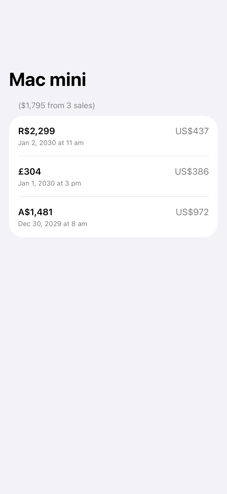</a></td>
    <td><a href="Modules/ProductDetail/Tests/ProductDetailUITests/Views/__Snapshots__/ProductDetailSUViewSnapshotTests/content.dark.png">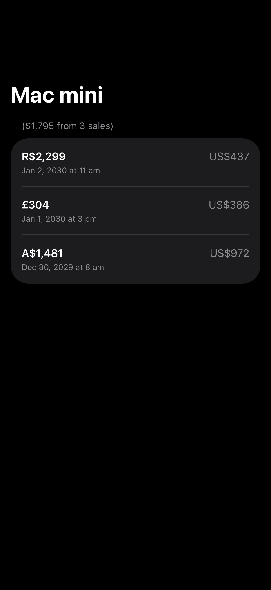</a></td>
    <td><a href="Modules/ProductDetail/Tests/ProductDetailUITests/Views/__Snapshots__/ProductDetailSUViewSnapshotTests/loading.light.png"></a></td>
    <td><a href="Modules/ProductDetail/Tests/ProductDetailUITests/Views/__Snapshots__/ProductDetailSUViewSnapshotTests/loading.dark.png"></a></td>
    <td><a href="Modules/ProductDetail/Tests/ProductDetailUITests/Views/__Snapshots__/ProductDetailSUViewSnapshotTests/empty.light.png">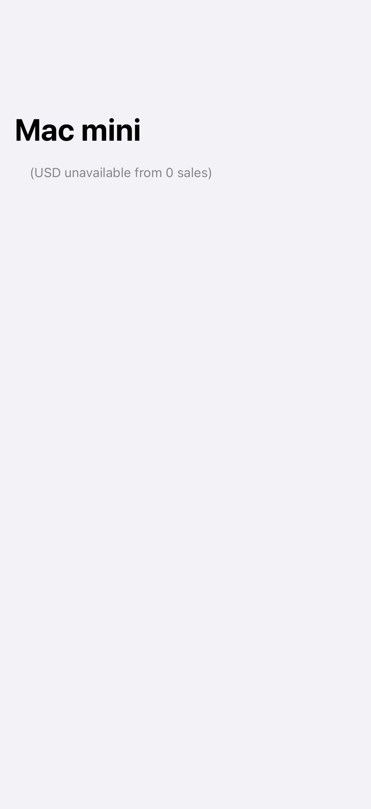</a></td>
    <td><a href="Modules/ProductDetail/Tests/ProductDetailUITests/Views/__Snapshots__/ProductDetailSUViewSnapshotTests/empty.dark.png"></a></td>
    <td><a href="Modules/ProductDetail/Tests/ProductDetailUITests/Views/__Snapshots__/ProductDetailSUViewSnapshotTests/error.light.png"></a></td>
    <td><a href="Modules/ProductDetail/Tests/ProductDetailUITests/Views/__Snapshots__/ProductDetailSUViewSnapshotTests/error.dark.png"></a></td>
    <td><a href="Modules/ProductDetail/Tests/ProductDetailUITests/Views/__Snapshots__/ProductDetailSUViewSnapshotTests/reloadFailure.light.png">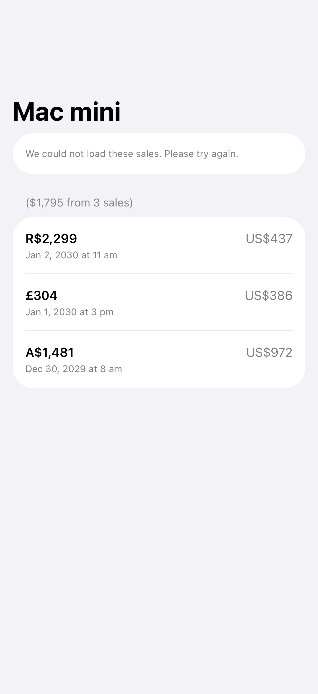</a></td>
    <td><a href="Modules/ProductDetail/Tests/ProductDetailUITests/Views/__Snapshots__/ProductDetailSUViewSnapshotTests/reloadFailure.dark.png">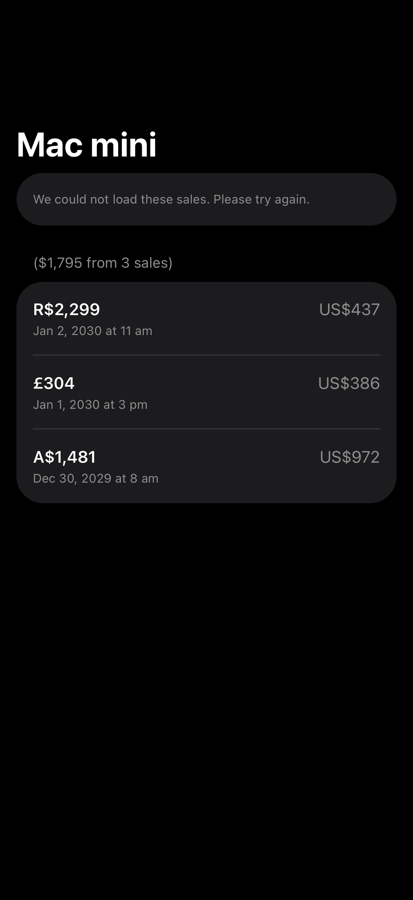</a></td>
    <td><a href="Modules/ProductDetail/Tests/ProductDetailUITests/Views/__Snapshots__/ProductDetailSUViewSnapshotTests/usdUnavailable.light.png">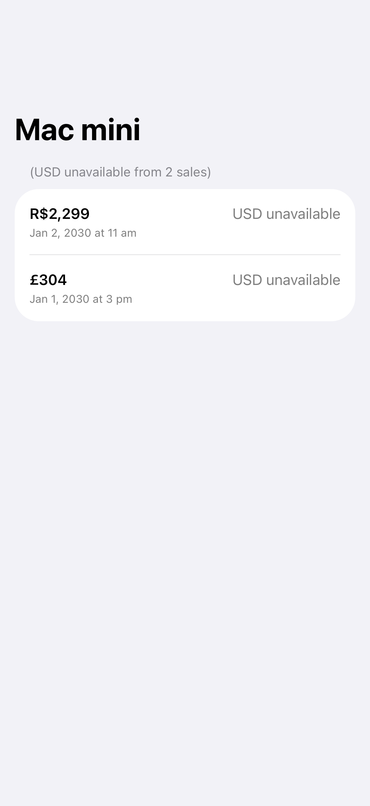</a></td>
    <td><a href="Modules/ProductDetail/Tests/ProductDetailUITests/Views/__Snapshots__/ProductDetailSUViewSnapshotTests/usdUnavailable.dark.png">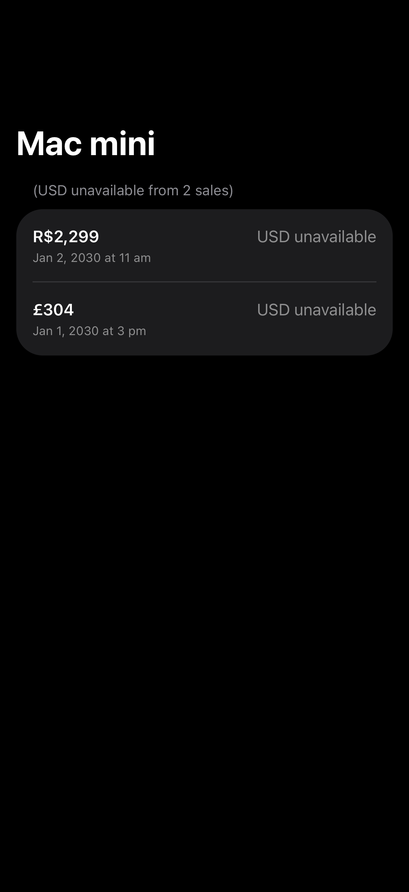</a></td>
  </tr>
</table>

### Data flow

```
ProductDetailSUView -> ProductDetailViewModel -> ProductDetailService -> /sales (required)
                                                                      -> /rates (optional)
                                              -> ProductDetailPolicy -> ProductDetailViewMapper
```

The two requests are deliberately not symmetrical:

```swift
async let sales = loadSales()
async let rates = try? await loadRates()
```

A sales failure throws and the screen shows an error. A rates failure becomes `nil` and the screen
still lists every sale in its own currency. The backend is required. The middleware is optional.

## Decisions worth explaining

**Money is never a `Double`.** Written as a Swift literal, `1.18` becomes `1.1799999999999997952`.
Amounts and rates cross every boundary as exact `Decimal`. The middleware sends rates as JSON strings
for the same reason, so nothing passes through binary floating point. Rounding happens once, in the
formatter, for display only.

**One unconvertible sale means no total, not a wrong total.** If a single sale is priced in a currency
the rate table does not quote, the header shows "USD unavailable" rather than a sum that silently
leaves that sale out. A number that excludes some of your sales is worse than no number, because
nothing on screen says it is incomplete.

**A 401 is final, so the app does not retry it.** `AuthenticatedHTTPClientDecorator` clears the token
where it sees the 401, then raises one event. The composition root returns to Login and shows "Your
session expired". Features never learn this happened. Transport failures are different: they show an
error and the data stays on screen.

**A failed refresh keeps the data.** If a reload fails while content is already showing, the message
appears above the content rather than replacing it. Losing what someone is reading is worse than
showing it next to an error.

**No pagination.** Neither `/products` nor `/sales` accepts a page or a cursor. More decisive: the
list shows a sales count per product, which is only correct once every sale has been seen, so paging
the sales request would show counts that creep upward and are wrong until the last page.

**Dates follow the reader's language; English matches the brief exactly.** `SaleDateFormatter` reads
its pattern and its am/pm symbols from the `.lproj` of the injected locale, so English reads
`Jan 2, 2030 at 11 am` exactly as the brief writes it, and Vietnamese reads `2 thg 1, 2030 lúc 11 SA`.

**US dollars are written two ways on purpose.** The brief shows `US$407` in a row but `$107,587` in
the header. No single locale produces both, so the row passes an explicit symbol while the header
uses the currency's own. The row needs it: `$437` sitting beside `R$2,299` is ambiguous.
`ProductDetailAcceptanceTests` pins both, through `usdInARow` and `usdInTheSummary`.

**The Keychain store has a single writer.** `KeychainTokenStore` is a `Sendable` final class whose only
mutable state is in the Keychain itself. The composition root is the one writer. If a second writer
ever appears, it should become an actor.

**The project file is generated.** `project.yml` is the source of truth and XcodeGen produces
`SalesInUSD.xcodeproj`, which is committed so you need no extra tool to open and build.

## Known limits

- **Both list screens download every sale in the system.** Neither `/products` nor `/sales` takes a filter, so the product list counts sales client side and the detail filters by product id after the fact. With real data the fix belongs on the server.
- **`ProductListService.loadSales` and `ProductDetailService.loadSales` load all sales, not one product's.** The names read as though they were scoped. `loadAllSales` would say the truth.
- **The 16 snapshot tests do not run in CI.** `CI-Modules` uses `swift test` on the Mac, where `canImport(UIKit)` is false and the suites compile out. `CI-App` runs the `SalesInUSD` scheme, whose test action holds only `SalesInUSDTests` and `SalesInUSDUITests`. The references are still committed and still checked in Xcode, but nothing enforces them on a pull request. The fix is a third CI job that runs the three UI targets on a simulator, which needs shared schemes with a test action, because the auto-created ones have none.
- **The services live in the app target.** `ProductListService`, `ProductDetailService` and `RemoteAuthAPI` each import only their own vertical, so they could live inside the packages. Keeping them in the composition root is consistent across all three, but it does mean their tests sit in `AppTests` rather than the package suites.

## Run the app

```bash
git clone git@github.com:anthony1810/sales-ios.git
cd sales-ios
open sales-ios.xcworkspace
```

Select the `SalesInUSD` scheme and any iOS 17.0 or later simulator, then Run. Log in with the tester
account from the challenge brief.

The product list and the product detail work against the real backend with no further setup. The US
dollar conversions need the middleware running:

```bash
cd ../sales-middleware && swift run --package-path Server      # serves http://localhost:8080
```

Without it the detail screen still lists every sale with its own currency and date, and says "USD
unavailable" instead of a converted figure. That is deliberate, not a failure state.

On a **physical device** `localhost` is the phone, not your Mac. Set an environment variable in the
scheme, Product, Scheme, Edit Scheme, Run, Arguments:

```
RATES_BASE_URL = http://<your-mac-ip>:8080
```

## Run the tests

### In Xcode

| What | Scheme | Destination | Then |
|---|---|---|---|
| App unit, acceptance and UI tests | `SalesInUSD` | any iPhone simulator | Cmd+U |
| One module target | `LoginFeature`, `LoginAPI`, `ProductListPresentation`, `ProductDetailAPI`, `Auth`, `SharedPresentation` and the rest | iPhone 17, iOS 26 | Cmd+U |
| Snapshot tests | `LoginUI`, `ProductListUI`, `ProductDetailUI` | iPhone 17, iOS 26 | Cmd+U |
| Packages with no UI | `HTTPClient`, `TestSupport` | My Mac | Cmd+U |

Opening `sales-ios.xcworkspace` in Xcode also creates `Login-Package` style schemes that run a whole
package at once. They live in `xcuserdata` and are not committed.

Use **iPhone 17, iOS 26** for anything with a snapshot test, because the references were recorded
there and another device or OS renders differently.

### From the command line

```bash
./Scripts/architecture-guard.sh

xcodebuild test -workspace sales-ios.xcworkspace -scheme SalesInUSD \
  -destination 'platform=iOS Simulator,name=iPhone 17'

swift test --package-path Modules/ProductList
```

The tests that need the network are opt in, because a test that needs a live account and a locally
started server should never be the reason a normal run goes red:

```bash
TEST_RUNNER_END_TO_END=1 TEST_RUNNER_RATES_BASE_URL=http://localhost:8080 \
  xcodebuild test -workspace sales-ios.xcworkspace -scheme SalesInUSD \
  -destination 'platform=iOS Simulator,name=iPhone 17'
```

To re-record snapshots after an approved UI change, add the environment variable `SNAPSHOT_RECORD`
with value `1`, run the tests once, remove it, run them again, and commit the new images under
`__Snapshots__`.

## The companion service

[`sales-middleware`](../sales-middleware) turns the upstream's eight mixed currency pairs into one
direct-to-USD rate per currency, using derived inverses and a breadth-first search from USD outwards.
It exists so that no client app ever duplicates the conversion logic. That repository has its own
README.
